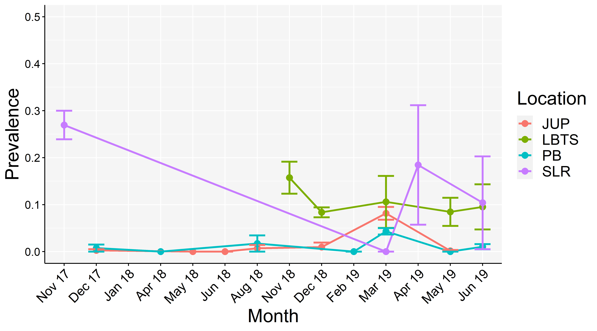

```{r, setup, include=FALSE}
knitr::opts_chunk$set(warning = FALSE, fig.align = 'left')
library(magrittr)
```

#### version: `r Sys.Date() %>%  format(format = "%B %d, %Y")`

### DOI GOES HERE


#### [GitHub repository](https://github.com/icombs2017/analysisOf3dModels/tree/master/Roving%20Diver){target="_blank"}
###
***
This code accompanies the disease prevalence survey portion within the manuscript **[Combs IR, Studivan MS, and Voss JD (2020). Quantifying impacts of stony coral tissue loss disease on corals in Southeast Florida with surveys and 3D photogrammetry]**

If you download the accompanying GitHub directory, you should be able to re-run these analyses by following along with the code chunks in R Studio. 

***

### All analyses performed with R version `r getRversion()`

# Basic setup of R environment
***

## Loading required packages
For the following analyses we will require the use of a number of different R packages. Most of which can be sourced from CRAN, but some may be downloaded from GitHub. We can use the following code to load in the packages and install any packages not previously installed in the R console.

```{r, packages, include = TRUE, message = FALSE, warning = FALSE, results = 'hide'}

if (!require("pacman")) install.packages("pacman")
pacman::p_load(ggplot2, stringr,dplyr, vegan, pairwiseAdonis, patchwork, flextable, officer, gdata)
pacman::p_load_gh("pmartinezarbizu/pairwiseAdonis/pairwiseAdonis")

```
<br><br>

# Loading data
***

Loading the data set into R. All analyses are conducted from a master spreadsheet dating back to November 2017. We are using the function `read.xls` from the package *gdata* to read the excel file straight into R. Note: this master spreadsheet only has 1 sheet. <br><br>
This data set contains a count of "TMTC" or "too many to count" so we are adding a line of `na.strings = "TMTC"` which will take that string and treat it as an NA. This is so we can manipulate that column as integers. `na.strings` can be expanded to include other qualifiers if necessary. We included the code `class(rd$TotalHealthy)` to ensure that the column containing the "TMTC" input is being read as an integer and that the `na.strings = "TMTC"` worked. We are calling it `rd` for "roving diver" which is the type of surveys these are.

```{r, load, include = "true"}
rd <- read.xls("../data/RovingDiverSurveysManuscript.xlsx", head = T, na.strings ="TMTC")
class(rd$Healthy)
head(rd)
```

# Data manipulation
***
One of the purposes of this pipeline is to manipulate the data set a number of ways in order to achieve specific outputs for reports. We are going to mainly do this using the package `dplyr`. We are doing these manipulations and calculations in `R` to prevent manipulation of the master database and to ensure continuity and consistency throughout this longterm monitoring project.

Our first step is to format the dates they can be read by `R`. Reading the data in from the excel spreadsheet, R recognizes the Date column as a Date format (if you read your data in as a csv file this won't happen). The data is read as YYY/MM/DD, but often it is helpful to parse things out by Month or by Year so we are adding a column using a M-Y format. This same code can be changed to include a YYYY format as well.

```{r, dateFormat, include = TRUE }
rd$MonthYear = format(as.Date(as.Date(rd$Date), format = "%y/%m/%d"), "%m-%y")
rd$Date = as.Date(rd$Date)
class(rd$Date)
head(rd)
```
We see that we have MonthYear at the end of the dataset and Date is now in a YYYY-MM-DD format.

<br><br>

We also want to add a few more columns like **County**, **Location**, **Total Observations**, and **Prevalence**. We will start with adding **County** and **Location**. <br><br>Our dataset includes surveys across three counties, at four different locations, but they are entered into the data set at the individual site level (**SiteCode**). It is often helpful, especially when reporting, to report at the County level or even by location. **SiteCode** is the individual sites where surveys occur (ex: SEFL05, T328, BC1, etc), **Location** is the general area where operations occur (ex: Jupiter, Lauderdale-by-the-Sea), and **County** is the county where operations occur (ex: Martin County, Palm Beach County, and Broward County).

```{r, countyLocation, include = TRUE }
rd$County = if_else(rd$SiteCode %in% c("SEFL01", "SEFL02", "SEFL03", "SLR South", "SLR Central", "SLR Ledge", "SLR North"), "Martin",
                       if_else(rd$SiteCode %in% c("T328", "BC1", "FTL4"), "Broward", "Palm Beach"))

rd$Location= if_else(rd$SiteCode %in% c("SEFL01", "SEFL02", "SEFL03", "SLR South", "SLR Central", "SLR Ledge", "SLR North"), "SLR",
                       if_else(rd$SiteCode %in% c("T328", "BC1", "FTL4"), "PMP",
                       if_else(rd$SiteCode %in% c("SEFL04", "SEFL05", "SEFL06"), "JUP",
                       if_else(rd$SiteCode %in% c("SEFL08", "SEFL09", "SEFL10", "SEFL11", "SEFL12"), "WPB", ""))))
head(rd)
```
We can see that the **County** and **Location** columns have been added to the end of the data set!


<br><br>

Now we are going to tabulate the all of the disease observations and healthy observations into a **TotalObservations** column. This data set has 11 different keys for "disease" from unknown (**UK**) to black band disease (**BB**), to stony coral tissue loss disease (**SCTLD**), as well as paling (**P**) and bleaching (**BL**). We are combinging all of those, along with the **Healthy** column to have a **TotalObservations** column.

```{r, totalObservations, inclue = TRUE}
rd$TotalObservations <- rd$UK + rd$DS + rd$BB + rd$RB + rd$YB + rd$SCTLD + rd$WP + rd$WS + rd$P + rd$PB + rd$BL + rd$Healthy
head(rd)
```


# Subsetting by Site
***
For the purposes of reporting, you might want to block certain dates out, and only report on certain dates. Here, as an example, we are subsetting everything before July 3, 2019. This code can be modified to capture any time period you may need. We are calling it `rd.early` because it encapsulates the early days of our surveys. I am also subsetting for only our longterm monitoring sites. 

```{r, subsetDate, include = TRUE}
rd.site <- subset(rd, SiteCode %in% c("SEFL01", "SEFL02", "SEFL04", "SEFL05", "SEFL06", "SEFL08", "SEFL11", "SEFL12", "SLR North", "SLR South", "SLR Central", "SLR Ledge", "BC1", "T328", "FTL4")) 

head(rd.site)
tail(rd.site)
```
Checking to see that we have our earliest date `head(rd.site)` and our cut-off date `tail(rd.site)` to confirm the subset worked.
<br><br>

# Tabulating Data
***
Currently the data set has very high resolution, to species level, which may not be necessary for certain reports. Now, using `dplyr` we will tabulate the data into a more concise form. In this example we are assuming that we need to report on data from the time frame we subsetted earlier (November 2017 - June 2019), and the report only needs to know prevalence data by County. Sometimes packages mask other packages so I am specifying that I want to use the function `select` from the package `dplyr` by using the following: `dplyr::select`.

```{r, countyData, include = TRUE}
countyData <- rd.site %>% dplyr::select(c(SiteCode, County, MonthYear, SpeciesCode, SCTLD, TotalObservations)) %>% group_by(SiteCode,MonthYear,County) %>% summarise_if(is.integer, sum)
countyData


siteData <- rd.site %>% dplyr::select(c(SiteCode, Location, County, MonthYear, SpeciesCode, SCTLD, TotalObservations)) %>%  group_by(SiteCode, MonthYear, Location) %>% summarise_if(is.integer, sum)
siteData
```
To summarize: I am selecting (`dplyr::select()`) from the data the columns of **SiteCode**, **County**, **MonthYear**, **SpeciesCode**, **TLD**, and **TotalObservations**. grouping them (`group_by()`) by  **SiteCode**, **MonthYear**, and **County**; and adding (`summarise_if(is.integer, sum)`) all integers found in that subset (in this case **TLD** and **TotalObservations**).

<br><br>
# Calculating Prevalence Data
***
We want to calculate SCTLD disease prevalence at our monitoring sites. To do this, we will calculate prevalence by diving our SCTLD observations (**SCTLD**) from our total number of observations (**TotalObservations**). The syntax used here is very similar to the way we calculated **TotalObservations**.

```{r, prevalence, include = TRUE}
countyData$Prevalence = countyData$SCTLD/countyData$TotalObservations
head(countyData)
siteData$Prevalence = siteData$SCTLD/siteData$TotalObservations
head(siteData)
```
You can see that we added a **Prevalence** column to the data set!
<br><br>

# Running PERMANOVA in R
***
Now our report needs some analyses. Here we want to see if our prevalence data varies between counties and through time. We will be using a PERMANOVA in R to assess this. We will use the ```adonis()``` function in *vegan*.

```{r, permanova, include = TRUE}
prev.dist <- vegdist(countyData$Prevalence, method="euclidean", na.rm= TRUE)
# replaces missing data (NAs) with 0
prev.dist[is.na(prev.dist)] <- 0

# testing for homogeneity of variance among locations
prev.disp <- betadisper(prev.dist, group=countyData$County)
permutest(prev.disp, bias.adjust = TRUE, perm = 9999)
# significant test value indicates heterogeneous variance

# post hoc tests
prev.disp.HSD <- TukeyHSD(prev.disp)
prev.disp.HSD
# indicates unequal variance in site Martin

# plots showing higher variance in Martin versus other locations
boxplot(prev.disp)
# These results suggest unequal variance among locations, with highest variance attributed to Martin
# Since Martin is also the smallest group, this can result in liberal PERMANOVA results (per Anderson and Walsh 2013)
# However, given the results of the PERMANOVA below, the interpretation remains that only models differ within locations

# running the PERMANOVA
set.seed(999)
prev.perm <- adonis(formula = Prevalence ~ County*MonthYear, data = countyData, method = "euclidian", permutations = 9999, na.rm = TRUE)
prev.perm
```
County is significantly different, but Time is not.

<br><br>

Now lets conduct a pairwise comparison to determine which county (or counties) is driving the variation. We will be using `pairwise.adonis()` from *pairwiseAdonis*.

```{r, pairwisePERMANOVA, incldue = TRUE}
set.seed(999)
prev.pairwise <- pairwise.adonis(countyData[c(6)],factors=countyData$County,
                             sim.method='euclidian',p.adjust.m='bonferroni', perm = 9999)
prev.pairwise
```
We see that Palm Beach County is significantly different from both Martin County and Broward County. Now its time to visualize this data!

<br><br>.


Now we are tabulating the data into a publication ready table.
```{r, prevalencePermTab, include = TRUE, ft.align = "left"}

prevPermTab = data.frame("Test" = "PERMANOVA", "Comparison" = "County", "pseudo.F" = prev.perm$aov.tab$F.Model[1], "p.value" = prev.perm$aov.tab$`Pr(>F)`[1]) %>% 
  add_row("Test" = " ", "Comparison" = "Date", "pseudo.F" = prev.perm$aov.tab$F.Model[2], "p.value" = prev.perm$aov.tab$`Pr(>F)`[2]) %>% 
  add_row("Test" = " ", "Comparison" = "County:Date", "pseudo.F" = prev.perm$aov.tab$F.Model[3], "p.value" = prev.perm$aov.tab$`Pr(>F)`[3]) %>% 
  add_row("Test" = c("Pairwise", replicate(nrow(prev.pairwise)-1,"")), "Comparison" = prev.pairwise$pairs, "pseudo.F" = prev.pairwise$F.Model, "p.value" = prev.pairwise$p.adjusted) %>%
  
mutate(p.value = replace(p.value, p.value >= 0.05, NA)) %>%
mutate(p.value = replace(p.value, p.value < 0.001, "< 0.001")) %>% 
mutate_if(is.character, str_replace_all, pattern = "vs", replacement = "–") %>%
flextable() %>%
set_header_labels(Data.set = "Data set") %>% 
flextable::compose(part = "header", j = "pseudo.F", value = as_paragraph("Psuedo-", as_i("F"))) %>%
flextable::compose(part = "header", j = "p.value", value = as_paragraph(as_i("p"), "-value")) %>% 
autofit() %>%
font(fontname = "Times New Roman", part = "all") %>%
fontsize(size = 12, part = "all") %>%
bold(part = "header") %>% 
colformat_num(j = "pseudo.F", digits = 2) %>%
colformat_num(j = "p.value", digits = 3, na_str = "ns") %>% 
align(align = "center", j = "p.value") %>% 
align(align = "center", j = "p.value")


prevPermanovaDoc = read_docx()
prevPermanovaDoc = body_add_flextable(prevPermanovaDoc, value = prevPermTab)
print(prevPermanovaDoc, target = "../tables/Table1.docx")
prevPermTab


```


<br><br>.

# Data Visualization
***
Plotting disease prevalence at each County over time. But first we need to subset by **County**. Just a note, *SEFL01* and *SEFL02* are actually *SLR Central* and *SLR South*, respectively. For plotting purposes I am renaming them. I am also arranging the factor levels chronologically. 

```{r, Plot, include = TRUE, ft.align = "left", eval = FALSE}
countyPlot <- countyData %>% 
  dplyr::select(c(County, MonthYear, Prevalence)) %>% 
  group_by(MonthYear,County) %>% 
  add_count() %>%  
  summarise(avgPrevalence = mean(Prevalence), n = max(n), sd = sd(Prevalence), stderror = sd(Prevalence)/sqrt(n))


county.prev1 <- ggplot(countyPlot, aes(MonthYear, avgPrevalence, group = County, color = County))+
  geom_point()+
  geom_line()+
  geom_errorbar(aes(ymin = avgPrevalence - stderror, 
                    ymax = avgPrevalence + stderror),
                    width = 0.5)+
  scale_x_discrete(name = "Month",limits=c("11-17","12-17","01-18", "04-18", "05-18", "06-18", "08-18", "11-18", "12-18", "02-19", "03-19", "04-19", "05-19", "06-19"), labels =c("Nov 17","Dec 17","Jan 18", "Apr 18", "May 18", "Jun 18", "Aug 18", "Nov 18", "Dec 18", "Feb 19", "Mar 19", "Apr 19", "May 19", "Jun 19"))+
  ylim(0,0.5)+
  #facet_wrap(~County, scale = "free")+
  labs(y = "Prevalence", x = "Month")

county.prev1

county.prev <- county.prev1 + theme(
  panel.grid.major = element_line(size = 0.5, linetype = 'solid', colour = "white"),
  panel.background = element_rect(fill = '#F5F5F5'), 
  plot.title = element_text(hjust = 0.5), 
  axis.line = element_line(colour = "black"), 
  axis.ticks = element_line(color="black"), 
  text = element_text(size=20, color="black"), 
  axis.text.x=element_text(angle = 45, hjust = 1, size=14, color="black"), 
  axis.text.y=element_text(size=12, color="black")
)

county.prev


ggsave("../figures/Fig3.png", plot = county.prev, height = 5, width = 9, units = 'in',dpi = 600)
```


 


############################################################
############################################################
############################################################
############################################################
############################################################
############################################################
############################################################

# Tabulating Data
***
Currently the data set has very high resolution, to species level, which may not be necessary for certain reports. Now, using `dplyr` we will tabulate the data into a more concise form. In this example we are assuming that we need to report on data from the time frame we subsetted earlier (November 2017 - June 2019), and the report only needs to know prevalence data by Location Sometimes packages mask other packages so I am specifying that I want to use the function `select` from the package `dplyr` by using the following: `dplyr::select`.

```{r, locationData, include = TRUE}

locationData <- rd.site %>% dplyr::select(c(SiteCode, Location, County, MonthYear, SpeciesCode, SCTLD, TotalObservations)) %>%  group_by(SiteCode, MonthYear, Location) %>% summarise_if(is.integer, sum)
locationData
```
To summarize: I am selecting (`dplyr::select()`) from the data the columns of **SiteCode**, **Location**,**County**, **MonthYear**, **SpeciesCode**, **SCTLD**, and **TotalObservations**. grouping them (`group_by()`) by  **SiteCode**, **MonthYear**, and **Location**; and adding (`summarise_if(is.integer, sum)`) all integers found in that subset (in this case **SCTLD** and **TotalObservations**).

<br><br>
# Calculating Prevalence Data
***
We want to calculate SCTLD disease prevalence at our monitoring sites. To do this, we will calculate prevalence by diving our SCTLD observations (**SCTLD**) from our total number of observations (**TotalObservations**). The syntax used here is very similar to the way we calculated **TotalObservations**.

```{r, prevalence, include = TRUE}
locationData$Prevalence = locationData$SCTLD/locationData$TotalObservations
head(locationData)

```
You can see that we added a **Prevalence** column to the data set!
<br><br>

# Running PERMANOVA in R
***
Now our report needs some analyses. Here we want to see if our prevalence data varies between counties and through time. We will be using a PERMANOVA in R to assess this. We will use the ```adonis()``` function in *vegan*.

```{r, permanova, include = TRUE}
prev.dist <- vegdist(locationData$Prevalence, method="euclidean", na.rm= TRUE)
# replaces missing data (NAs) with 0
prev.dist[is.na(prev.dist)] <- 0

# testing for homogeneity of variance among locations
prev.disp <- betadisper(prev.dist, group=locationData$Location)
permutest(prev.disp, bias.adjust = TRUE, perm = 9999)
# significant test value indicates heterogeneous variance

# post hoc tests
prev.disp.HSD <- TukeyHSD(prev.disp)
prev.disp.HSD
# indicates unequal variance in site SLR

# plots showing higher variance in Martin versus other locations
boxplot(prev.disp)
# These results suggest unequal variance among locations, with highest variance attributed to Martin
# Since Martin is also the smallest group, this can result in liberal PERMANOVA results (per Anderson and Walsh 2013)
# However, given the results of the PERMANOVA below, the interpretation remains that only models differ within locations

# running the PERMANOVA
set.seed(999)
prev.perm <- adonis(formula = Prevalence ~ Location*MonthYear, data = locationData, method = "euclidian", permutations = 9999, na.rm = TRUE)
prev.perm
```
Location is significantly different, but Time is not.

<br><br>

Now lets conduct a pairwise comparison to determine which county (or counties) is driving the variation. We will be using `pairwise.adonis()` from *pairwiseAdonis*.

```{r, pairwisePERMANOVA, incldue = TRUE}
set.seed(999)
prev.pairwise <- pairwise.adonis(locationData[c(6)],factors=locationData$Location,
                             sim.method='euclidian',p.adjust.m='bonferroni', perm = 9999)
prev.pairwise
```
We see that Jupiter and West Palm are significantly different from both St. Lucie Reef and Lauderdale-by-the-Sea. Now its time to visualize this data!

<br><br>.


Now we are tabulating the data into a publication ready table.
```{r, prevalencePermTab, include = TRUE, ft.align = "left"}

prevPermTab = data.frame("Test" = "PERMANOVA", "Comparison" = "Location", "pseudo.F" = prev.perm$aov.tab$F.Model[1], "p.value" = prev.perm$aov.tab$`Pr(>F)`[1]) %>% 
  add_row("Test" = " ", "Comparison" = "Date", "pseudo.F" = prev.perm$aov.tab$F.Model[2], "p.value" = prev.perm$aov.tab$`Pr(>F)`[2]) %>% 
  add_row("Test" = " ", "Comparison" = "Location:Date", "pseudo.F" = prev.perm$aov.tab$F.Model[3], "p.value" = prev.perm$aov.tab$`Pr(>F)`[3]) %>% 
  add_row("Test" = c("Pairwise", replicate(nrow(prev.pairwise)-1,"")), "Comparison" = prev.pairwise$pairs, "pseudo.F" = prev.pairwise$F.Model, "p.value" = prev.pairwise$p.adjusted) %>%
  
mutate(p.value = replace(p.value, p.value >= 0.05, NA)) %>%
mutate(p.value = replace(p.value, p.value < 0.001, "< 0.001")) %>% 
mutate_if(is.character, str_replace_all, pattern = "vs", replacement = "–") %>%
flextable() %>%
set_header_labels(Data.set = "Data set") %>% 
flextable::compose(part = "header", j = "pseudo.F", value = as_paragraph("Psuedo-", as_i("F"))) %>%
flextable::compose(part = "header", j = "p.value", value = as_paragraph(as_i("p"), "-value")) %>% 
autofit() %>%
font(fontname = "Times New Roman", part = "all") %>%
fontsize(size = 12, part = "all") %>%
bold(part = "header") %>% 
colformat_num(j = "pseudo.F", digits = 2) %>%
colformat_num(j = "p.value", digits = 3, na_str = "ns") %>% 
align(align = "center", j = "p.value") %>% 
align(align = "center", j = "p.value")


prevPermanovaDoc = read_docx()
prevPermanovaDoc = body_add_flextable(prevPermanovaDoc, value = prevPermTab)
print(prevPermanovaDoc, target = "../tables/Table1Revised.docx")
prevPermTab


```


<br><br>.

# Data Visualization
***
Plotting disease prevalence at each County over time. But first we need to subset by **Location**. Just a note, *SEFL01* and *SEFL02* are actually *SLR Central* and *SLR South*, respectively. For plotting purposes I am renaming them. I am also arranging the factor levels chronologically. 

```{r, Plot, include = TRUE, ft.align = "left", eval = FALSE}
locationPlot <- locationData %>% 
  dplyr::select(c(Location, MonthYear, Prevalence)) %>% 
  group_by(MonthYear,Location) %>% 
  add_count() %>%  
  summarise(avgPrevalence = mean(Prevalence), n = max(n), sd = sd(Prevalence), stderror = sd(Prevalence)/sqrt(n))


location.prev1 <- ggplot(locationPlot, aes(MonthYear, avgPrevalence, group = Location, color = Location))+
  geom_point(size = 3)+
  geom_line(size = 1)+
  geom_errorbar(aes(ymin = avgPrevalence - stderror,
                    ymax = avgPrevalence + stderror),
                    width = 0.5,
                    size = 1)+
  scale_x_discrete(name = "Month",limits=c("11-17","12-17","01-18", "04-18", "05-18", "06-18", "08-18", "11-18", "12-18", "02-19", "03-19", "04-19", "05-19", "06-19"), labels =c("Nov 17","Dec 17","Jan 18", "Apr 18", "May 18", "Jun 18", "Aug 18", "Nov 18", "Dec 18", "Feb 19", "Mar 19", "Apr 19", "May 19", "Jun 19"))+
  ylim(0,0.5)+
  #facet_wrap(~County, scale = "free")+
  labs(y = "Prevalence", x = "Month")

location.prev1

location.prev <- location.prev1 + theme(
  panel.grid.major = element_line(size = 0.5, linetype = 'solid', colour = "white"),
  panel.background = element_rect(fill = '#F5F5F5'), 
  plot.title = element_text(hjust = 0.5), 
  axis.line = element_line(colour = "black"), 
  axis.ticks = element_line(color="black"), 
  text = element_text(size=20, color="black"), 
  axis.text.x=element_text(angle = 45, hjust = 1, size=14, color="black"), 
  axis.text.y=element_text(size=12, color="black")
)

location.prev


ggsave("../figures/Fig3Revised.png", plot = county.prev, height = 5, width = 9, units = 'in',dpi = 600)


```


